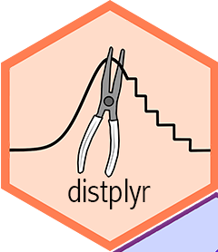

<!-- README.md is generated from README.Rmd. Please edit that file -->

# distplyr: LEGACY VERSION 

<!-- badges: start -->

<!-- badges: end -->

The distplyr package has moved to a better home at
<https://github.com/probaverse/distplyr>. Please use that version.
