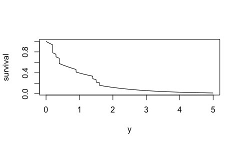

<!-- README.md is generated from README.Rmd. Please edit that file -->

# distplyr 

<!-- badges: start -->

[](https://www.tidyverse.org/lifecycle/#experimental)
[](https://github.com/vincenzocoia/distplyr/actions)
[](https://codecov.io/gh/vincenzocoia/distplyr?branch=master)
[](https://CRAN.R-project.org/package=distplyr)
[](https://cran.r-project.org/web/licenses/MIT)
[](https://lifecycle.r-lib.org/articles/stages.html#experimental)
<!-- badges: end -->

distplyr provides a grammar for manipulating (univariate) probability
distributions, so that you can make probability distributions that
realistically represent your data. Distributions add colour to your
analysis: they show a complete picture of uncertainty.

Use distplyr to:

-   start with distribution “building blocks” with the `dst_*()` family
    of functions, and
-   manipulate these distributions using distplyr verbs.

The result is easy access to a wide range of distributions – more than
just “elementary” distributions like a Normal or Poisson distribution.

distplyr sits on top of the [distionary](https://distionary.netlify.app)
package, which provides a framework for creating distribution “building
blocks” as well as evaluating distributions.

The distplyr package name is inspired by the
[dplyr](https://dplyr.tidyverse.org/) R package: whereas distplyr
provides a grammar for manipulating *distributions*, dplyr provides a
grammar for manipulating *data*.

## Installation

`distplyr` is not on CRAN yet, so the best way to install it is:

``` r
devtools::install_github("vincenzocoia/distplyr")
```

Attaching the distplyr package with `library(distplyr)` also attaches
the distionary package.

## Basic Usage

``` r
library(distplyr)
```

Want to model a count variable that starts at 1, not 0? Consider
shifting a Poisson distribution.

``` r
(d1 <- dst_pois(1.5) + 1)
#> shift dst
#> 
#>  components :
#> $distribution
#> pois parametric dst
#> 
#>  name :
#> [1] "pois"
#> 
#> $shift
#> [1] 1
```

Here’s its probability mass function:

``` r
enframe_pmf(d1, at = 0:10) %>% 
  plot()
```


Or, maybe you have positive continuous data and you’d like its tail to
continue as an exponential distribution:

``` r
x <- c(1.6, 0.9, 0.2, 1.4, 0.4, 0.3, 0.2, 0.4, 0.2, 1.5)
mu <- mean(x)
(d2 <- dst_empirical(x) %>% 
  graft_right(dst_exp(mu), breakpoint = max(x)))
#> Mixture Distribution
#> 
#> Components: 
#> # A tibble: 2 × 4
#>   distributions probs breakpoint include
#>   <named list>  <dbl>      <dbl> <lgl>  
#> 1 <finite>        0.9        1.6 FALSE  
#> 2 <slic_lft>      0.1        1.6 FALSE
```

Here’s the survival function:

``` r
plot(d2, "survival", from = 0, to = 5, n = 1000)
```


Or maybe you’d like to mix the empirical and Exponential distributions:

``` r
(d4 <- mix(dst_empirical(x), dst_exp(mu)))
#> Mixture Distribution
#> 
#> Components: 
#> # A tibble: 2 × 2
#>   distributions probs
#>   <named list>  <dbl>
#> 1 <finite>        0.5
#> 2 <exp>           0.5
plot(d4, "survival", from = 0, to = 5, n = 1000)
```



## distplyr in Context

There are a few other R packages that handle probability distributions.
The key differentiator with distplyr is its grammar, and the flexibility
of the package distionary, which distplyr sits on top of.

Some examples:

-   The distributional package also allows for distribution
    manipulation, but is less flexible, and builds vectorization into
    the package. distplyr (and distionary) deliberately leaves
    vectorization up to the user, since distributions can be evaluated
    to produce a variety of output types.
    -   Development of distributional appears to have happened at the
        same time as distplyr, and distributional uses a similar family
        of functions – `dist_*()` – to make probability distributions.
-   The
    [distr](https://cran.r-project.org/web/packages/distr/index.html)
    package allows you to make distributions including empirical ones,
    and transform them, using S4 classes, but the interface is complex.
    distplyr aims to provide a human-centric interface by providing a
    grammar.

------------------------------------------------------------------------

Please note that the ‘distplyr’ project is released with a [Contributor
Code of Conduct](CODE_OF_CONDUCT.md). By contributing to this project,
you agree to abide by its terms.
